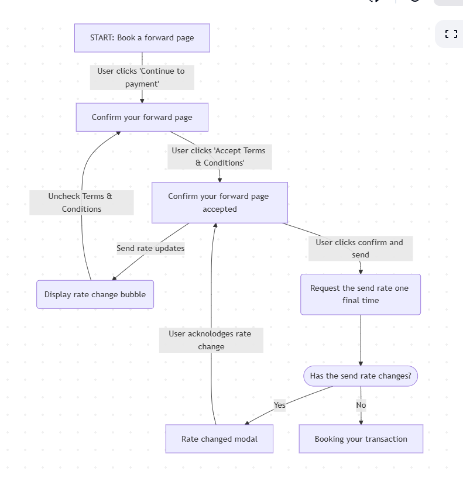

# Multiparter

The goal of Multiparter is to create a syntax for managing multipart forms using a decision tree compatible data structure.

At it's core we should be able to represent decision trees like this...



With a data structure like this:

```vue
<script>
const paymentData = ref<PaymentData | null>(null)

const multiparterProps = useMultiform({
    steps: [
         {
            component: Confirm
            // optional, can be used to skip steps
            canNavigateToNext: computed(() => true)
            canNavigateToPrevious: computed(() => true)
            props: {
            // typescript forces you to fill out all props
                text: "Are you sure you want to do this form"
            },
            // Typesystem forces you to handle all emits
            emits: {
                onClickConfirm: () => {
                    navigate.next()
                }
            }
        },
        {
            component: GetRecipientPaymentInfoForm
            props: {
                onBack: () => navigate.back(1) // move back by one
            },
            // Typesystem forces you to handle all emits
            emits: {
            onSubmit: (data) => {
                paymentData.value = data
                navigate.next()
            }
            }
        },
        {
            component: ComplianceForm
            existsAsStep: computed(() => 
               paymentData.value.amount > 1000
            )
            props: {
            },
            // Typesystem forces you to handle all emits
            emits: {
                onSubmit: (compliance) => {
                    complianceData.value = complianceData
                },
                onBack: () => {
                    navigate.back()
                }
            },
        },
        {
            component: DetailsSummary,
            props: {
                data: paymentData
            },
            emits: {
                onSubmit: () => {
                    alert(JSON.stringify(paymentData))
                }
            }
        }

    ]
})
</script>

<template>
     <MultipartForm  :props="multiparterProps"/>
</template>
```
